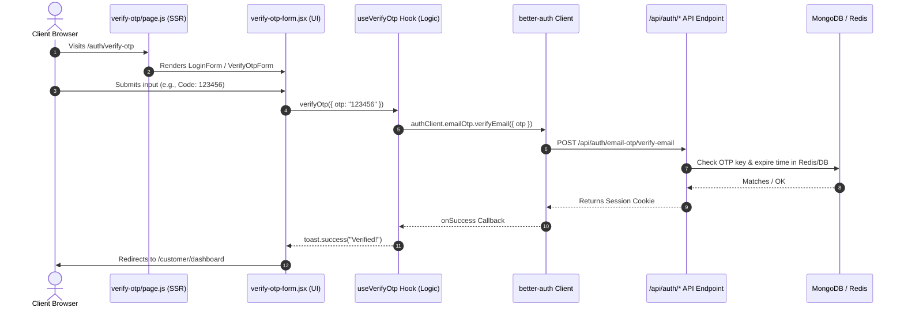
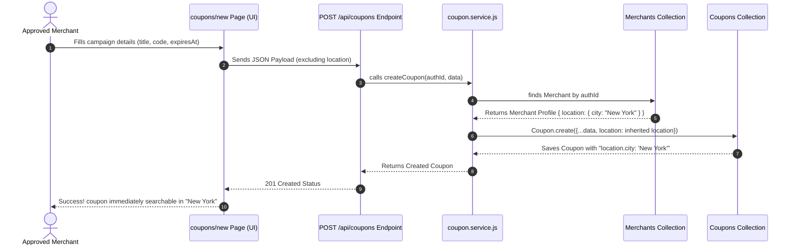

# 🚀 Vouchiqo Completed Features, Tech Stack & Code Flow

This document details the completed development tasks, used technology stack, and the dynamic architectural code flows implemented in the Vouchiqo platform.

---

## 🌟 1. Completed Features

### 🔐 1.1. Scalable Authentication System
* **SSR Page Shells**: All auth entry points are clean Server Components exporting optimized SEO metadata and importing client forms:
  * [Login Page](file:///c:/Users/itsco/OneDrive/Desktop/Vouchiqo/app/auth/login/page.js)
  * [Register Page](file:///c:/Users/itsco/OneDrive/Desktop/Vouchiqo/app/auth/register/page.js)
  * [Forgot Password Page](file:///c:/Users/itsco/OneDrive/Desktop/Vouchiqo/app/auth/forgot-password/page.js)
  * [Reset Password Page](file:///c:/Users/itsco/OneDrive/Desktop/Vouchiqo/app/auth/reset-password/page.js)
  * [Verify OTP Page](file:///c:/Users/itsco/OneDrive/Desktop/Vouchiqo/app/auth/verify-otp/page.js)
* **Separation of Logic (Hooks)**: Authentication logic is extracted into reusable React Query hooks calling Better Auth client API:
  * [`useLogin`](file:///c:/Users/itsco/OneDrive/Desktop/Vouchiqo/features/auth/hooks/use-login.js), [`useRegister`](file:///c:/Users/itsco/OneDrive/Desktop/Vouchiqo/features/auth/hooks/use-register.js), [`useForgotPassword`](file:///c:/Users/itsco/OneDrive/Desktop/Vouchiqo/features/auth/hooks/use-forgot-password.js), [`useResetPassword`](file:///c:/Users/itsco/OneDrive/Desktop/Vouchiqo/features/auth/hooks/use-reset-password.js), and [`useVerifyOtp`](file:///c:/Users/itsco/OneDrive/Desktop/Vouchiqo/features/auth/hooks/use-verify-otp.js) + [`useResendOtp`](file:///c:/Users/itsco/OneDrive/Desktop/Vouchiqo/features/auth/hooks/use-verify-otp.js).
* **Pure UI Components**: Clean forms focusing purely on styling and rendering, wrapped in a shared `<AuthCard>`:
  * [`login-form.jsx`](file:///c:/Users/itsco/OneDrive/Desktop/Vouchiqo/features/auth/components/login-form.jsx)
  * [`register-form.jsx`](file:///c:/Users/itsco/OneDrive/Desktop/Vouchiqo/features/auth/components/register-form.jsx)
  * [`forgot-password-form.jsx`](file:///c:/Users/itsco/OneDrive/Desktop/Vouchiqo/features/auth/components/forgot-password-form.jsx)
  * [`reset-password-form.jsx`](file:///c:/Users/itsco/OneDrive/Desktop/Vouchiqo/features/auth/components/reset-password-form.jsx)
  * [`verify-otp-form.jsx`](file:///c:/Users/itsco/OneDrive/Desktop/Vouchiqo/features/auth/components/verify-otp-form.jsx)
* **Brute-Force Protection & Rate Limiting**: Server-side rate limiting is active on auth routes.
* **OTP Verification plugin**: Registered `emailOTP` on the backend and `emailOTPClient` on the client. Fully implemented customized HTML email delivery via `Resend`.

---

### 📍 1.2. Geolocation-Based Deals (Near Me)
* **User-Side Detection**: Implemented [`useLocation`](file:///c:/Users/itsco/OneDrive/Desktop/Vouchiqo/hooks/use-location.js) hook.
  * Checks browser permission status silently on mount (never auto-prompts).
  * Automatically coordinates browser Geolocation API with OpenStreetMap Nominatim reverse-geocoding API to parse the user's current city.
  * Displays a manual fall-back input field if permissions are blocked or geocoding fails.
* **City Filtering Widget**: Created the [`NearbyDeals`](file:///c:/Users/itsco/OneDrive/Desktop/Vouchiqo/features/location/components/nearby-deals.jsx) component, loaded on the [Homepage](file:///c:/Users/itsco/OneDrive/Desktop/Vouchiqo/app/page.js), which queries `/api/coupons?city=...` to display local, verified discount cards.

---

### 💼 1.3. Merchant profile & Coupon Location Integrity
* **Real Profile Integration**: Refactored the [Merchant Business Profile Page](file:///c:/Users/itsco/OneDrive/Desktop/Vouchiqo/app/merchant/profile/page.js) from a mock dashboard to query `/api/merchants/me` and perform real updates via `PUT /api/merchants/:id` using React Query.
* **Auto-Location Injector**: Modified coupon creation logic in [`coupon.service.js`](file:///c:/Users/itsco/OneDrive/Desktop/Vouchiqo/modules/coupon/coupon.service.js): when a merchant creates a coupon, the coupon automatically inherits the merchant's profile location (`city`, `state`, `country`) as a default. This ensures coupons instantly become searchable in local geolocation filters without requiring redundant entry inputs.

---

## 🛠️ 2. Technology Stack

* **Frontend Framework**: Next.js 16 (React 19) utilising App Router, Client Components, and SSR Server pages.
* **State & Query Management**: TanStack React Query (v5) for fetching, caching, invalidating, and mutating asynchronous server state.
* **Authentication**: Better Auth (v1.6) with MongoDB database adapter.
  * Customized user model schema with roles (`customer`, `merchant`, `admin`) and status (`isActive`).
  * Built-in rate limiting and cookie caching.
  * Plugins: `inferAdditionalFields` and `emailOTP`.
* **Database**: MongoDB (Mongoose v9) with singleton connection handling for fast query compilation and zero HMR leaks.
* **Cache & Locks**: Redis (`ioredis` v5) for rate limiting and distributed locks.
* **Async Job Worker**: BullMQ (v5) for out-of-band processing (e.g. view-count records, coupon expiry schedules).
* **Emails**: Resend (v6) client API.
* **Formatting/Linting**: Biome (v2) for ultra-fast checks, formatted syntax, and organised imports.

---

## 🔄 3. Key Architectural Code Flows

### 3.1. Authentication Code Flow


---

### 3.2. Geolocation Deal Discovery Flow
```mermaid
graph TD
    A[Visitor hits Homepage] --> B{Geolocation Permission?}
    B -- Already Granted --> C[Silent Auto-Detect Location]
    B -- Prompt Blocked/Denied --> D[Display Manual City Input Fallback]
    C --> E[Browser Geolocation API Coord: lat/lon]
    E --> F[OpenStreetMap Nominatim Reverse-Geocoding]
    F --> G[Extract City Name e.g. "Paris"]
    G --> H[Update Location State]
    D -- User Enters City --> H
    H --> I[Query API: GET /api/coupons?city=Paris]
    I --> J[Fetch Coupons Filtered by City]
    J --> K[Display Nearby Deals Grid]
```

---

### 3.3. Merchant Coupon Creation & Auto-Location Injection Flow

