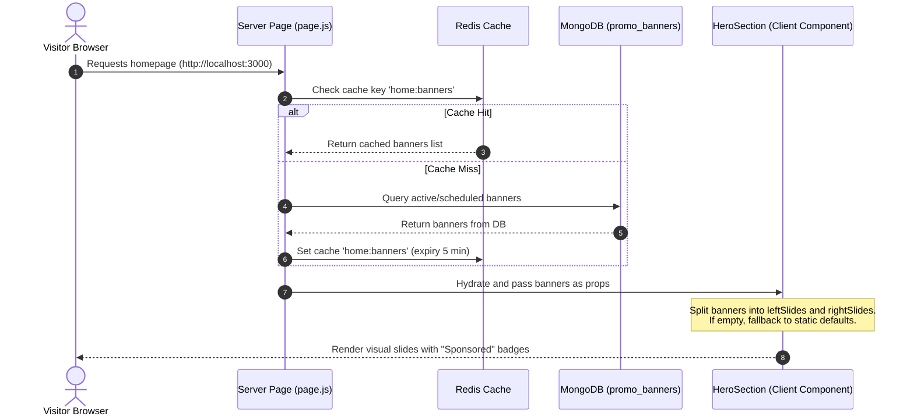

# Vouchiqo Homepage Carousel System Architecture

This document explains the dynamic, cached, and database-driven carousel banner system powering the homepage hero section.

---

## 🚀 Architectural Steps & Flow

### 📋 Step 1: Who Adds the Slides?

Promotional banners can be created and managed by two primary actors:

*   **Platform Admins:**
    *   Can configure and publish promo slides directly in the database.
    *   Specify the slide details: `title`, `subtitle`, `buttonText`, `link`, and slot layout (`left-hero` vs `right-promo`).
    *   Upload images to Cloudinary and set scheduling controls (`startDate` / `endDate`).
    *   Review and approve or reject submissions from merchants.
*   **Merchants (Paid / Sponsored Slots):**
    *   Merchants subscribed to **Pro / Enterprise** tiers or who purchase a **"Homepage Featured Slot Boost"** can submit custom promotional images.
    *   These records are saved with `isPaid: true` (which triggers a visual `"Sponsored"` badge on the frontend) and assigned a higher `priority` parameter.

---

### 🔍 Step 2: Who is Showing (Prioritization & Fallback Rules)?

The service layer query in [banner.service.js](file:///w:/Work%27s%20Projects/nhhh/modules/admin/banner.service.js) fetches active slides using these criteria:

1.  **Time Gating:** Filter to include only banners where `status` is `"active"` and the current system date falls within `startDate` and `endDate` boundaries (or if dates are not specified/null).
2.  **Sort Hierarchy:** Slides are sorted by `priority` (descending) followed by `createdAt` (descending). Paid/sponsored banners automatically show up first due to their higher priority values.
3.  **Automatic Fallback:** If there are zero active slides configured in MongoDB, the page automatically falls back to rendering the default static brands list (Amazon, Hostinger, Redrail, etc.) to ensure the hero area never appears blank.

---

### 🎨 Step 3: Which Banner Goes Where?

The React carousels split the banner list based on the **`slot`** parameter:

*   **`slot: "left-hero"`**: Displays inside the large **75% width** primary landing slider.
*   **`slot: "right-promo"`**: Displays inside the smaller **25% width** promo card layout on the right.
*   **Sponsorship Transparent Tag:** Banners flagged with `isPaid: true` render a modern, unobtrusive semi-transparent `"Sponsored"` badge overlay in the top-right corner.

---

### ⚙️ Step 4: Step-by-Step Code Execution Flow

The request-response lifecycle works as follows:

1.  **Request:** A user loads the homepage in their browser.
2.  **Server Fetch:** The page is server-side rendered. [page.js (app/(public))](file:///w:/Work%27s%20Projects/nhhh/app/(public)/page.js) runs on the server and invokes `getPromoBanners()`.
3.  **Redis Caching:** The service checks Redis (`home:banners`) first:
    *   *Hit:* Banners are read instantly from cache.
    *   *Miss:* Banners are fetched from MongoDB, serialized, saved to Redis with a 5-minute TTL, and returned.
4.  **Hydration:** The serialized array is passed as props to the [HomeClient](file:///w:/Work%27s%20Projects/nhhh/components/landing/HomeClient/HomeClient.jsx) layout component.
5.  **Splitting & Rendering:** The [HeroSection](file:///w:/Work%27s%20Projects/nhhh/components/landing/HeroSection.jsx) processes the lists, groups them by slot, schedules the 6-second auto-rotate intervals, and displays the banners to the visitor.
